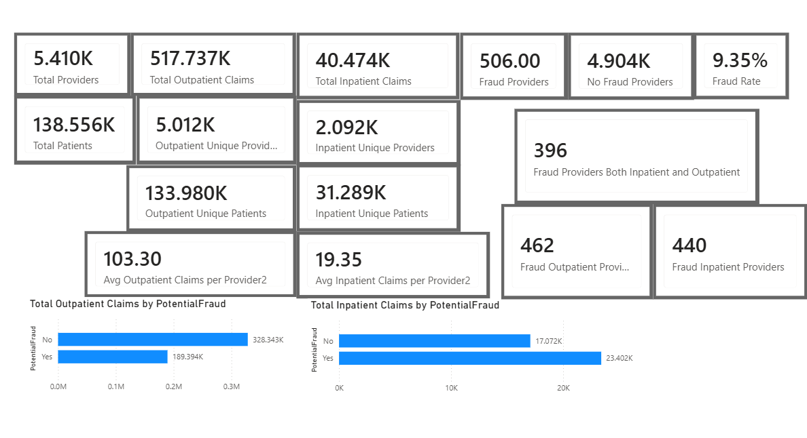
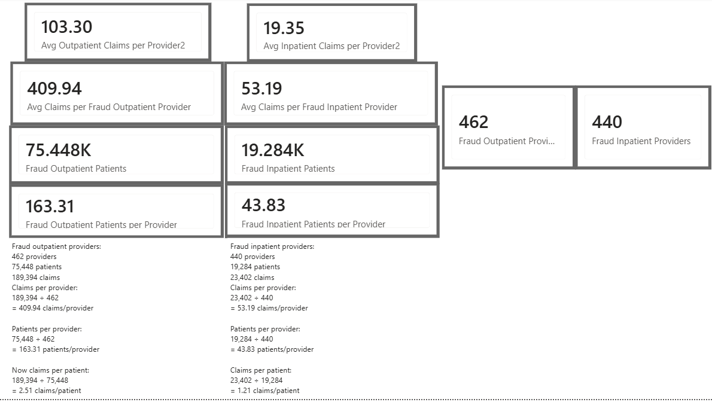
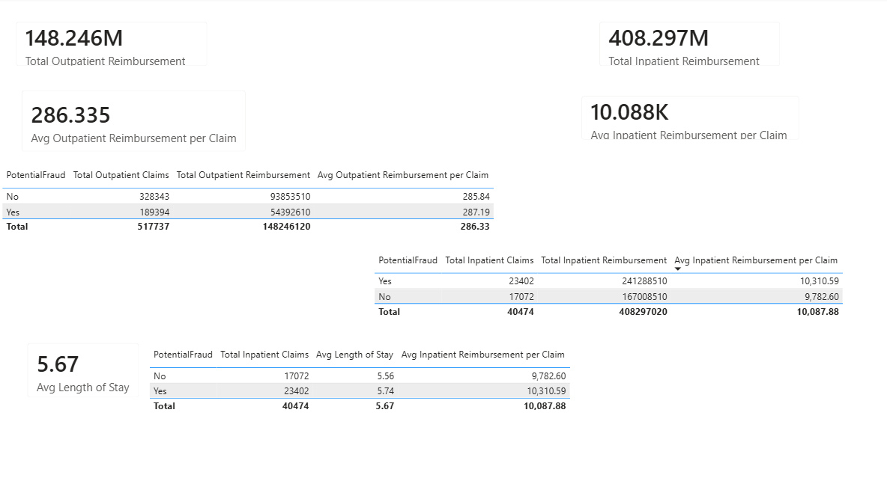
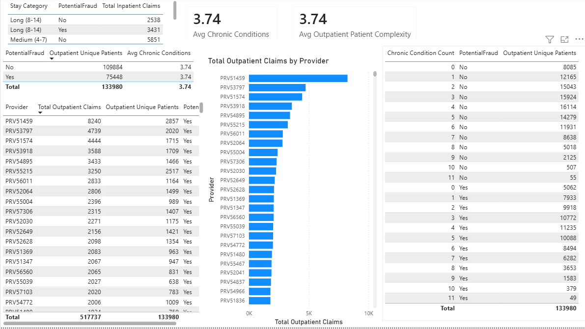
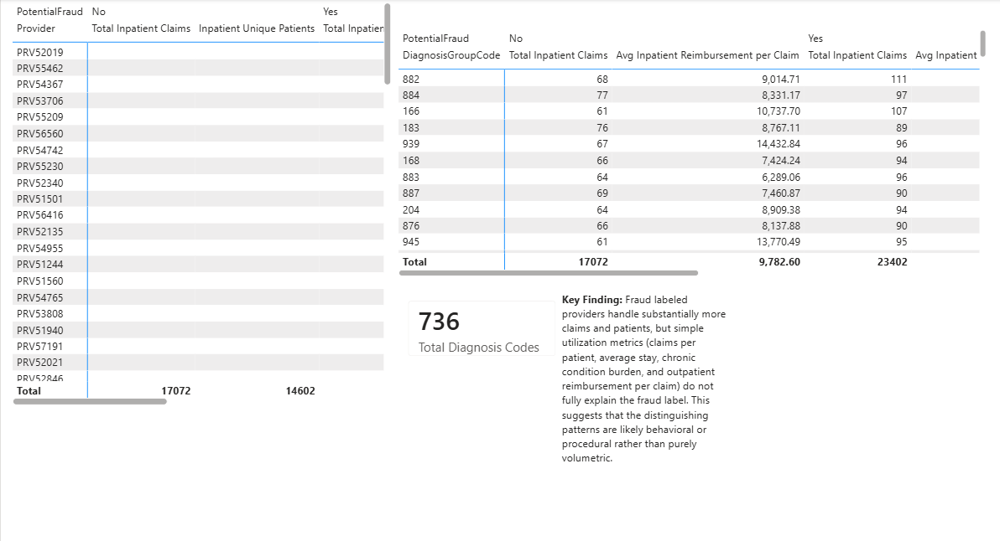

#  Healthcare Insurance Fraud Analysis

Power BI | DAX | Power Query | Exploratory Data Analysis

## Project Overview

Healthcare insurance fraud is a complex problem that cannot be explained by a single metric.

This project explores a healthcare claims dataset using Power BI to investigate the characteristics of providers labeled as **Potential Fraud**.

Rather than assuming that higher claim volume indicates fraudulent behavior, the analysis follows a hypothesis-driven approach, evaluating provider activity, patient populations, reimbursement patterns, hospitalization metrics, diagnosis groups, and patient complexity.

The objective is to determine whether these variables explain the fraud classification or whether more complex behavioral patterns are likely responsible.

## Business Questions

This project investigates the following questions:

- Do fraud-labeled providers submit more claims?
- Is higher claim volume explained by a larger patient population?
- Do fraud-labeled providers generate more claims per patient?
- Are reimbursement amounts significantly different?
- Do fraud-labeled providers keep patients hospitalized longer?
- Do they treat patients with greater clinical complexity?
- Can diagnosis groups explain the fraud classification?

## Dataset

This analysis combines four related datasets:

| Dataset | Description |
|----------|-------------|
| **Train** | Provider information and fraud label (`PotentialFraud`). |
| **Train_Outpatientdata** | Outpatient claims submitted by providers. |
| **Train_Inpatientdata** | Inpatient claims submitted by providers. |
| **Train_Beneficiarydata** | Patient demographic information, chronic conditions, and annual reimbursement data. |

## Tools & Skills

### Tools
- Power BI
- DAX
- Power Query

### Skills Demonstrated
- Data Modeling
- Data Transformation (Power Query)
- DAX Measures & Calculated Columns
- KPI Development
- Interactive Dashboard Design
- Data Visualization
- Exploratory Data Analysis (EDA)
- Business Insight Generation

##  Methodology

This project follows a hypothesis-driven exploratory data analysis (EDA) approach.

Instead of assuming that providers labeled as **Potential Fraud** were identified because they submitted more claims, each hypothesis was tested independently by comparing fraud and non-fraud providers.

To avoid misleading conclusions, several metrics were normalized before interpretation, including:

- Claims per provider
- Patients per provider
- Claims per patient
- Average reimbursement per claim
- Average length of stay
- Average chronic condition count

The analysis focused on understanding **why** providers were classified as Potential Fraud rather than simply describing the data.
##  Dashboard Pages

### Dashboard 1 – Executive Overview

 
Provides a high-level summary of the dataset, including the number of providers, fraud rate, inpatient and outpatient claims, and overall reimbursement metrics.

---

### Dashboard 2 – Provider Activity

 
Compares provider activity by analyzing claim volume, patient volume, claims per provider, and claims per patient to determine whether higher activity explains the fraud classification.

---

### Dashboard 3 – Financial Analysis

 
Explores reimbursement patterns by comparing total and average reimbursement amounts for inpatient and outpatient claims between fraud and non-fraud providers.

---

### Dashboard 4 – Clinical Analysis

 
Analyzes patient complexity through chronic conditions, average length of stay, and diagnosis distributions to identify potential clinical differences between fraud and non-fraud providers.

---

### Dashboard 5 – Investigation & Findings

 
 
Summarizes the investigation by exploring provider behavior, diagnosis groups, and key observations that help explain the results obtained throughout the analysis.

##  Key Findings

- The dataset contains **5,410 providers**, of which **506 (9.35%)** are labeled as **Potential Fraud**.
- Fraud-labeled providers submitted substantially more inpatient and outpatient claims than non-fraud providers.
- Fraud-labeled providers also treated significantly more unique patients.
- After comparing claims per patient and claims per provider, higher claim volume was found to be largely associated with larger patient populations rather than higher utilization per patient.
- Average outpatient reimbursement per claim was nearly identical between fraud and non-fraud providers, while inpatient reimbursement per claim showed only a modest increase.
- Average hospital length of stay and patient chronic condition burden were very similar across both groups.
- Analysis of diagnosis groups did not identify a single diagnosis pattern capable of explaining the fraud classification.

### Main Conclusion

The exploratory analysis suggests that **higher claim volume or patient volume alone is insufficient to explain the observed fraud classification**. The findings indicate that additional behavioral, procedural, or temporal patterns would likely be required to distinguish fraud-labeled providers from non-fraud providers.

## Limitations

This dataset provides the fraud label (`PotentialFraud`) but does not include the criteria or business rules used to assign that classification.

As a result, this analysis identifies patterns associated with fraud-labeled providers but cannot determine the exact reason why a provider was classified as Potential Fraud.

The conclusions presented in this project are based on exploratory data analysis and should be interpreted as analytical observations rather than evidence of fraudulent behavior.

